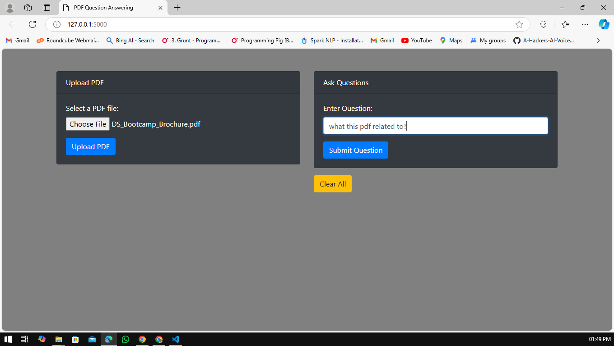
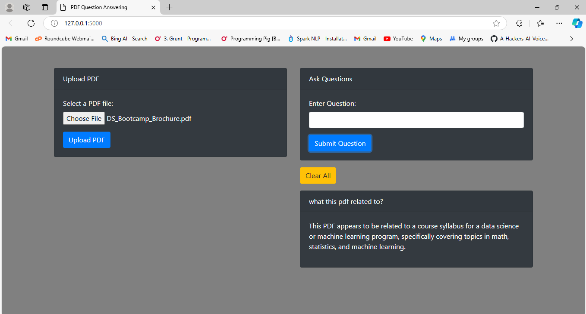

# PDF Q&A System
## Project Summery:
<b>Objective:</b> The project's objective is to create a system that enables users to submit PDF documents and pose questions in response to the content of those documents. The system efficiently retrieves responses from the PDF text using an advanced large language model (LLM), LLaMA 3.1 (70B), and Chroma as the vector database. With the help of the project, users will be able to upload files once and query the document several times to get pertinent results. The interface will be simple to use.

#### Technologies Used:

<li><b>Flask: </b>Web framework for developing the web application and handling routes.</li>
<li><b>LangChain: </b>For building LLM-based applications with integration of document loaders, retrievers, and chain logic.</li>
<li><b>ChatGroq: </b>Large language model API (LLaMA 3.1) used for answering user questions.</li>
<li><b>PyPDFLoader: </b> For loading and splitting PDF content into manageable chunks.</li>
<li><b>HuggingFace Instruct Embeddings: </b>Pre-trained embeddings model used to convert document text into dense vector representations.</li>
<li><b>FAISS: </b> A vector store for storing embeddings and performing fast similarity searches.</li>
 
 

